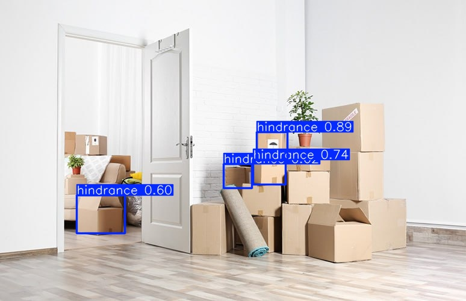
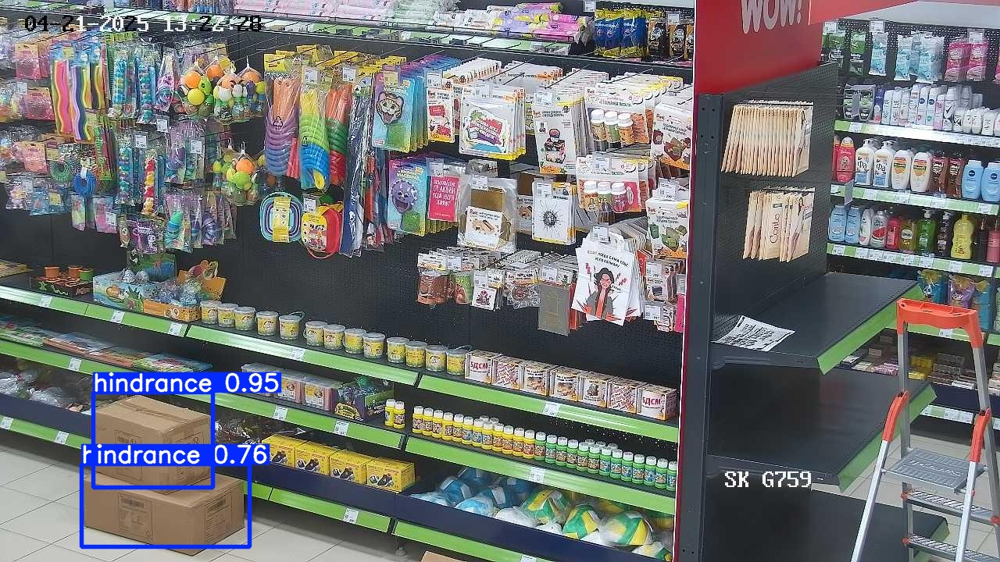

# Hindrances Finder

Этот проект для автоматического поиска препятствий (hindrance) на изображениях с использованием компьютерного зрения.

---

## Содержание

- [Функционал](#функционал)
- [Установка](#установка)
- [Запуск](#запуск)
  - [FastAPI (Backend)](#fastapi-backend)
  - [Streamlit (Frontend)](#streamlit-frontend)
- [Формат запроса](#формат-запроса)
- [Конфигурация](#конфигурация)
- [Обратная связь](#обратная-связь)

---

## Пример работы детектора

<!--   
 -->

<!-- <div align="center">
  
  
</div> -->


| Исходное изображение        | Обработанное изображение     |
|-----------------------------|------------------------------|
|  |  |

| Исходное изображение        | Обработанное изображение     |
|-----------------------------|------------------------------|
|  |  |


## Функционал

- `/detect` — обнаружение препятствий на изображении
- `/models` — список доступных моделей (yolov8n, yolov8s, yolov8m)
- `/health` — проверка работоспособности API
- Веб-интерфейс для загрузки изображений с визуализацией результатов

---

## Установка

1. Клонируйте репозиторий:
```bash
git clone -b i.fronin https://github.com/kiseleq/Hindrances_finder.git
cd Hindrances_finder
```

2. Установите зависимости:

```bash
pip install -r requirements.txt
```

3. Загрузите веса модели в папку models/

---

## Запуск

### FastAPI (Backend)

Запуск сервера:
```bash
uvicorn app_api:app --reload --host 127.0.0.1 --port 5000
```

Сервер будет доступен по адресу: http://127.0.0.1:5000

Пример запроса:
```bash
curl -X POST http://127.0.0.1:5000/detect \
     -F "file=@test_image.jpg" \
     -H "Content-Type: multipart/form-data"
```

### Streamlit (Frontend)

Запуск веб-приложения:
```bash
streamlit run srteamlit_app.py --server.port 5000
```

Веб-интерфейс подключается к API по адресу `http://localhost:5000`.


## Формат запроса

Пример JSON для предсказания:
```json
{
  "status": "success",
  "predictions": [
    {
      "class": "person",
      "confidence": 0.92,
      "bbox": [100, 150, 300, 400]
    }
  ],
  "processing_time": 0.12
}
```

## Конфигурация

Создайте config.yaml в корне проекта:

```yaml
model:
  weights: "models/yolov8n.pt"
  device: "cuda:0"
  params:
    conf_thres: 0.5
    iou_thres: 0.45
api:
  max_file_size: 10
  allowed_extensions: [".jpg", ".png", ".jpeg"]
```

---

## Обратная связь

Если вы нашли ошибку или у вас есть предложения по улучшению, создайте issue или pull request!
Вы также можете связаться с командой напрямую: **xxxxx@yandex.ru**