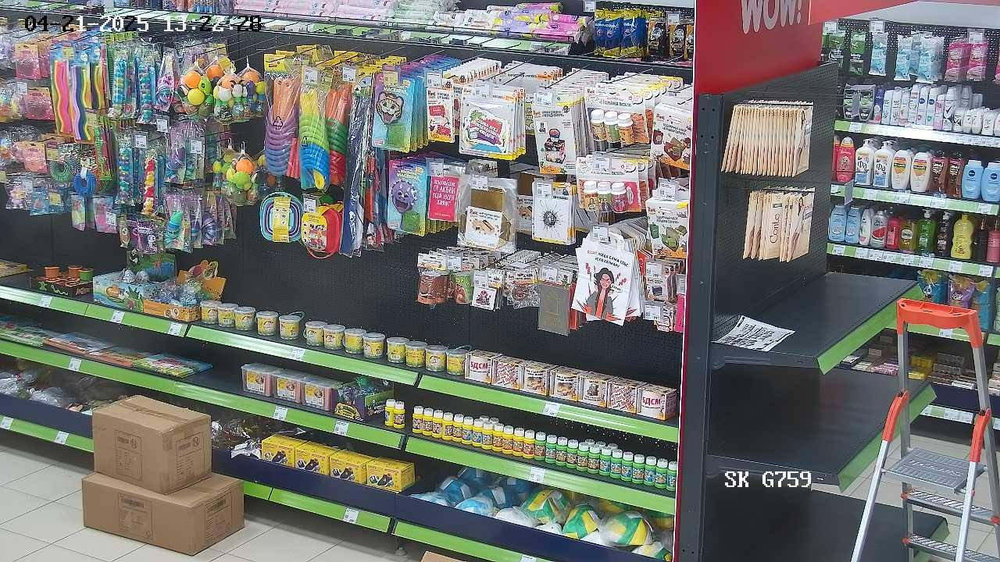

# Hindrances Finder

Этот проект для автоматического поиска препятствий в торговом зале на изображениях с использованием компьютерного зрения.

---

## Содержание

- [Пример работы детектора](#Пример-работы-детектора)
- [Установка](#установка)
- [Запуск](#запуск)
  - [FastAPI (Backend)](#fastapi-backend)
  - [Streamlit (Frontend)](#streamlit-frontend)
- [Обратная связь](#обратная-связь)

---

## Пример работы детектора


| Исходное изображение        | Обработанное изображение     |
|-----------------------------|------------------------------|
|  |  |

| Исходное изображение        | Обработанное изображение     |
|-----------------------------|------------------------------|
|  |  |

---

## Установка

1. Клонируйте репозиторий:
```bash
git clone -b main https://github.com/kiseleq/Hindrances_finder.git
cd Hindrances_finder
```

2. Установите зависимости:

```bash
pip install -r requirements.txt
```

---

## Запуск

### FastAPI (Backend)

Запуск сервера:
```bash
uvicorn app_api:app --reload --host 127.0.0.1 --port 5000
```

### Streamlit (Frontend)

Запуск веб-приложения:
```bash
streamlit run srteamlit_app.py --server.port 5000
```

Веб-интерфейс подключается к API по адресу `http://localhost:5000`.

---

## Обратная связь

Если вы нашли ошибку или у вас есть предложения по улучшению, создайте issue или pull request!
Вы также можете связаться с командой напрямую: **AndreyKiseleq.1@yandex.ru**